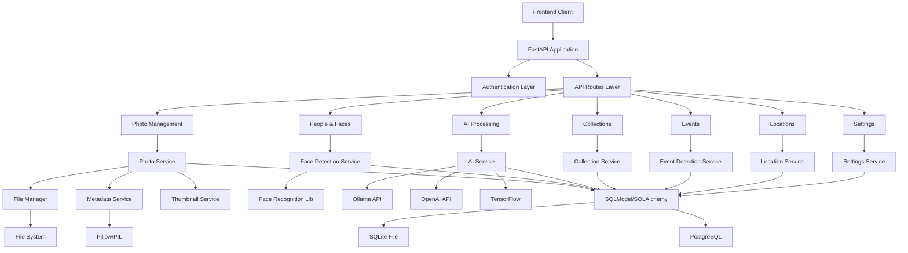

# Pictallion System Architecture

This document provides a detailed overview of the Python backend architecture, technology stack, service relationships, and database schema.

## Executive Summary

- Python FastAPI backend replaces TypeScript/Node.js backend
- Full API compatibility and feature parity
- Modular service layer, scalable deployment

## Architecture Diagram

## Technology Stack

- **Backend:** Python 3.11+, FastAPI, SQLModel, SQLAlchemy, Alembic
- **Frontend:** React 18+, TypeScript, Tailwind CSS
- **AI/ML:** Ollama, OpenAI, TensorFlow, face_recognition, dlib
- **Database:** PostgreSQL (production), SQLite (development)
- **Testing:** pytest, coverage, CI/CD via GitHub Actions

## Service Layer

- AIService: AI analysis, tag generation
- FaceDetectionService: Face detection, embedding
- FileManagerService: Tiered file management, EXIF extraction
- ThumbnailService: Dynamic thumbnail generation
- EventDetectionService: Event detection
- LocationService: GPS and geocoding
- MetadataEmbeddingService: EXIF/XMP embedding
- AdvancedSearchService: Search and filtering
- BurstPhotoDetectionService: Burst sequence analysis
- DuplicateDetectionService: Duplicate resolution

## Database Schema

- MediaAsset: Photo metadata
- FileVersion: Tiered file storage
- People, Faces: Face recognition data
- Collections, Events: Organization
- Settings: Configuration

## Design Principles

- Async-first, modular, testable
- RESTful API, OpenAPI docs
- Secure, scalable, maintainable

## References

- [Migration Guide](MIGRATION_GUIDE.md)
- [API Documentation](API_DOCUMENTATION.md)
- [Deployment Guide](DEPLOYMENT.md)
- [Security](SECURITY.md)