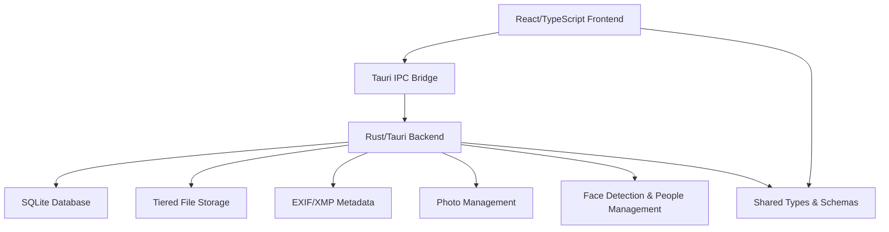

# Pictallion System Architecture

This document describes the overall architecture of Pictallion, including its frontend, backend, integration points, and design principles.

## High-Level Overview

Pictallion is a cross-platform photo management application with a modern React frontend and a secure, high-performance Rust/Tauri backend. The system is modular, testable, and designed for maintainability.

## Architecture Diagram

## Technology Stack

- **Frontend:** React 19, TypeScript, Vite, Material-UI, Tailwind CSS, Vitest
- **Backend:** Rust, Tauri, sqlx (async SQLite), rexiv2 (EXIF/XMP)
- **Integration:** Tauri IPC commands expose backend functionality to the frontend
- **Database:** SQLite (development and production)
- **Testing:** Vitest (frontend), Rust unit tests (backend), CI/CD via GitHub Actions

## Main Components

- **Frontend (`frontend/`):** User interface, state management, Tauri IPC integration, testing
- **Backend (`src-tauri/`):** Core logic, database, file storage, metadata extraction, IPC command definitions
- **Shared (`shared/`):** Common types, schemas, and utilities used by both frontend and backend

## Integration

- The frontend communicates with the backend via Tauri IPC commands.
- Shared modules provide consistent types and schemas across the stack.
- Tiered storage logic (bronze/silver/gold) is managed by the backend and exposed to the frontend.

## Database Schema

- **users:** Migration marker table
- **photos:** Photo metadata and tier information
- Additional tables defined in [`src-tauri/migrations/001_initial.sql`](src-tauri/migrations/001_initial.sql:1)

## Design Principles

- Async-first, modular, testable
- IPC-based API, OpenAPI compatibility planned
- Secure, maintainable, reproducible from `git clone` + `mise install` + `mise run build` + `docker compose up`

## References

- [API Documentation](API_DOCUMENTATION.md:1)
- [Deployment Guide](DEPLOYMENT.md:1)
- [Security](SECURITY.md:1)
