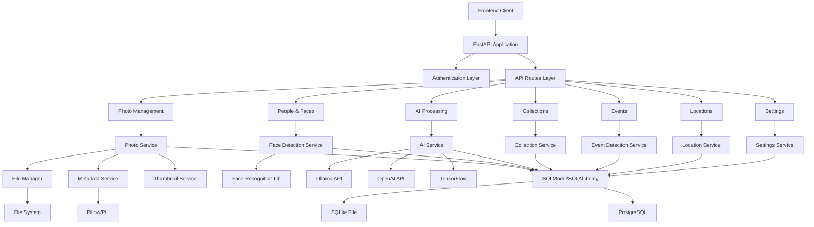

# Python Backend Architecture for Pictallion

## Executive Summary

This document outlines a comprehensive Python backend architecture to replace the current TypeScript/Express.js backend while preserving all existing functionality and API compatibility.

## Architecture Overview



## Technology Stack

### Framework Selection: **FastAPI**
- **Justification**: Async-first, high performance, automatic OpenAPI documentation, excellent type safety with Pydantic
- **Benefits**: Modern Python async/await support, built-in validation, easy testing, excellent ecosystem

### ORM Selection: **SQLModel + SQLAlchemy**
- **Justification**: Type-safe ORM with async support, easy dual database support, Pydantic integration
- **Benefits**: Seamless SQLite/Postgres compatibility, excellent migration support with Alembic

### Key Python Dependencies

```
# Web Framework
fastapi==0.104.1
uvicorn[standard]==0.24.0
pydantic==2.5.0

# Database & ORM
sqlmodel==0.0.14
sqlalchemy[asyncio]==2.0.23
alembic==1.13.1
aiosqlite==0.19.0
asyncpg==0.29.0

# AI/ML Libraries
tensorflow==2.15.0
face-recognition==1.3.0
dlib==19.24.2
mediapipe==0.10.8
openai==1.3.7

# Image Processing
Pillow==10.1.0
piexif==1.1.3
opencv-python==4.8.1.78

# File Handling
aiofiles==23.2.1
python-multipart==0.0.6

# Utilities
python-dotenv==1.0.0
pydantic-settings==2.1.0
httpx==0.25.2
nanoid==2.0.0

# Desktop GUI (Optional)
PyQt6==6.6.1
# OR
PySide6==6.6.1

# Development & Testing
pytest==7.4.3
pytest-asyncio==0.21.1
black==23.11.0
ruff==0.1.6
```

## Service Architecture

### Core Services (1:1 mapping from TypeScript)

1. **AIService** (`services/ai_service.py`)
   - Image analysis with OpenAI/Ollama
   - Tag generation and confidence scoring
   - People context integration

2. **FaceDetectionService** (`services/face_detection_service.py`)
   - Face detection using face_recognition/dlib
   - Face embedding generation and matching
   - Face crop generation and management

3. **FileManagerService** (`services/file_manager_service.py`)
   - Multi-tier file management (Bronze/Silver/Gold)
   - EXIF metadata extraction
   - File validation and security

4. **ThumbnailService** (`services/thumbnail_service.py`)
   - Dynamic thumbnail generation with Pillow
   - Caching and optimization

5. **EventDetectionService** (`services/event_detection_service.py`)
   - Holiday and birthday detection
   - Age calculation from photo dates

6. **LocationService** (`services/location_service.py`)
   - GPS coordinate processing
   - Reverse geocoding
   - Location clustering

7. **MetadataEmbeddingService** (`services/metadata_embedding_service.py`)
   - EXIF metadata embedding with piexif
   - XMP sidecar file generation

8. **AdvancedSearchService** (`services/advanced_search_service.py`)
   - Complex search queries with filters
   - Similarity matching and faceted search

9. **BurstPhotoDetectionService** (`services/burst_detection_service.py`)
   - Burst sequence identification
   - Photo similarity analysis

10. **DuplicateDetectionService** (`services/duplicate_detection_service.py`)
    - Perceptual hash comparison
    - Enhanced duplicate resolution

## API Route Mapping

### Complete API Compatibility Layer

FastAPI routers will preserve exact endpoint compatibility:

```python
# Photo Management (100+ endpoints)
/api/photos/* → photo_routes.py
/api/upload → upload_routes.py
/api/files/media/* → file_routes.py

# People & Faces (30+ endpoints)
/api/people/* → people_routes.py
/api/faces/* → face_routes.py

# AI Processing (20+ endpoints)
/api/ai/* → ai_routes.py

# Collections & Smart Collections (15+ endpoints)
/api/collections/* → collection_routes.py
/api/smart-collections/* → smart_collection_routes.py

# Events & Settings (25+ endpoints)
/api/events/* → event_routes.py
/api/settings/* → settings_routes.py

# Location Services (10+ endpoints)
/api/locations/* → location_routes.py

# System & Analytics (15+ endpoints)
/api/stats → analytics_routes.py
/api/health → health_routes.py
/api/system/* → system_routes.py
```

## Authentication & Security

### Current State: Standalone Desktop App
- No authentication required for current use case
- Future-ready design for optional authentication

### Planned Security Features
```python
# Optional authentication middleware
from fastapi import HTTPException, Depends
from fastapi.security import HTTPBearer

# For future multi-user support
async def get_current_user(token: str = Depends(HTTPBearer())):
    # JWT token validation
    pass

# Rate limiting middleware
from slowapi import Limiter, _rate_limit_exceeded_handler
from slowapi.util import get_remote_address

limiter = Limiter(key_func=get_remote_address)
```

### Input Validation
```python
# Pydantic models for all API inputs
class PhotoUpdateRequest(BaseModel):
    rating: Optional[int] = Field(None, ge=0, le=5)
    keywords: Optional[List[str]] = None
    location: Optional[str] = Field(None, max_length=255)

# Automatic request validation
@router.patch("/photos/{photo_id}")
async def update_photo(
    photo_id: str,
    updates: PhotoUpdateRequest,
    photo_service: PhotoService = Depends()
):
    return await photo_service.update_photo(photo_id, updates)
```

## Database Strategy

### Schema Migration
```python
# SQLModel models maintaining compatibility
class MediaAsset(SQLModel, table=True):
    id: str = Field(primary_key=True)
    original_filename: str
    created_at: datetime
    updated_at: datetime

class FileVersion(SQLModel, table=True):
    id: str = Field(primary_key=True)
    media_asset_id: str = Field(foreign_key="mediaasset.id")
    tier: str  # 'bronze', 'silver', 'gold'
    file_path: str
    metadata: Optional[Dict] = Field(sa_column=Column(JSON))
    # ... all existing fields
```

### Migration Strategy
1. **Schema Analysis**: Convert Drizzle schemas to SQLModel
2. **Data Migration**: Preserve all existing data integrity
3. **Validation**: Comprehensive testing of data consistency

## Deployment Strategies

### Docker Deployment
```dockerfile
# Multi-stage Dockerfile
FROM python:3.11-slim as base
WORKDIR /app
COPY requirements.txt .
RUN pip install --no-cache-dir -r requirements.txt

FROM base as production
COPY . .
EXPOSE 8000
CMD ["uvicorn", "main:app", "--host", "0.0.0.0", "--port", "8000"]
```

### Standalone Desktop App
```python
# PyQt6/PySide6 wrapper
import sys
from PyQt6.QtWidgets import QApplication, QMainWindow
from PyQt6.QtWebEngineWidgets import QWebEngineView
import uvicorn
import threading

class PictallionApp(QMainWindow):
    def __init__(self):
        super().__init__()
        self.setWindowTitle("Pictallion")
        
        # Start FastAPI server in background thread
        self.start_server()
        
        # Create web view
        self.web_view = QWebEngineView()
        self.web_view.load("http://localhost:8000")
        self.setCentralWidget(self.web_view)
    
    def start_server(self):
        def run_server():
            uvicorn.run("main:app", host="127.0.0.1", port=8000)
        
        server_thread = threading.Thread(target=run_server, daemon=True)
        server_thread.start()

if __name__ == "__main__":
    app = QApplication(sys.argv)
    window = PictallionApp()
    window.show()
    sys.exit(app.exec())
```

### Cross-Platform Packaging
```python
# setup.py for distribution
from setuptools import setup, find_packages

setup(
    name="pictallion",
    version="1.0.0",
    packages=find_packages(),
    install_requires=[
        "fastapi>=0.104.1",
        "uvicorn[standard]>=0.24.0",
        "PyQt6>=6.6.1",
        # ... other dependencies
    ],
    entry_points={
        "console_scripts": [
            "pictallion=pictallion.desktop:main",
        ],
    },
)
```

## Environment Configuration

### Settings Management
```python
# config/settings.py
from pydantic_settings import BaseSettings
from typing import Optional

class Settings(BaseSettings):
    # Database
    database_url: str = "sqlite:///./data/pictallion.db"
    db_type: str = "sqlite"  # sqlite | postgres
    
    # AI Services
    openai_api_key: Optional[str] = None
    ollama_base_url: str = "http://localhost:11434"
    preferred_ai_provider: str = "ollama"  # ollama | openai
    
    # File Storage
    media_base_path: str = "./data/media"
    uploads_path: str = "./uploads/temp"
    thumbnails_path: str = "./uploads/thumbnails"
    
    # Security
    secret_key: str = "your-secret-key-here"
    cors_origins: list = ["http://localhost:3000"]
    
    class Config:
        env_file = ".env"
        case_sensitive = False

settings = Settings()
```

### Environment Files
```bash
# .env.example
DB_TYPE=sqlite
DATABASE_URL=sqlite:///./data/pictallion.db

# AI Configuration
OPENAI_API_KEY=your_openai_key_here
OLLAMA_BASE_URL=http://localhost:11434
PREFERRED_AI_PROVIDER=ollama

# File Paths
MEDIA_BASE_PATH=./data/media
UPLOADS_PATH=./uploads/temp
THUMBNAILS_PATH=./uploads/thumbnails

# Security
SECRET_KEY=your-secret-key-here
CORS_ORIGINS=["http://localhost:3000"]
```

## Critical Services Priority Order

### Phase 1: Core Foundation (Week 1-2)
1. **Database Layer**: SQLModel setup with migrations
2. **File Manager**: Basic file operations and EXIF extraction
3. **Settings Service**: Configuration management
4. **Photo CRUD**: Basic photo management APIs

### Phase 2: Essential Features (Week 3-4)  
5. **AI Service**: OpenAI/Ollama integration
6. **Face Detection**: Basic face detection and storage
7. **Thumbnail Service**: Image thumbnail generation
8. **Upload System**: File upload and processing

### Phase 3: Advanced Features (Week 5-6)
9. **Face Recognition**: Face matching and suggestions
10. **Event Detection**: Holiday and birthday detection
11. **Search Service**: Advanced search and filtering
12. **Collection Management**: Collections and smart collections

### Phase 4: Specialized Features (Week 7-8)
13. **Burst Detection**: Photo sequence analysis
14. **Duplicate Detection**: Enhanced duplicate detection
15. **Location Services**: GPS and geocoding
16. **Metadata Embedding**: EXIF embedding for Gold tier

## Testing Strategy

### Test Coverage Plan
```python
# Comprehensive testing structure
tests/
├── unit/
│   ├── test_services/
│   │   ├── test_ai_service.py
│   │   ├── test_face_detection_service.py
│   │   └── test_file_manager_service.py
│   └── test_models/
├── integration/
│   ├── test_api_endpoints.py
│   ├── test_database_operations.py
│   └── test_file_operations.py
├── e2e/
│   ├── test_photo_workflow.py
│   ├── test_face_workflow.py
│   └── test_ai_workflow.py
└── fixtures/
    ├── sample_photos/
    └── test_database.db
```

### Test Categories
1. **Unit Tests**: Individual service methods
2. **Integration Tests**: Service interactions and database operations
3. **API Tests**: Complete endpoint functionality
4. **Performance Tests**: AI processing and file operations
5. **Migration Tests**: Data integrity during conversion

## Migration & Rollback Strategy

### Data Migration Process
1. **Backup Creation**: Full database and file system backup
2. **Schema Migration**: Convert Drizzle to SQLModel schemas
3. **Data Validation**: Verify data integrity post-migration
4. **API Testing**: Comprehensive endpoint validation
5. **Performance Benchmarking**: Ensure performance parity

### Rollback Plan
```python
# Migration rollback utilities
class MigrationManager:
    async def backup_database(self):
        # Create timestamped backup
        pass
    
    async def migrate_to_python(self):
        # Execute migration steps
        pass
    
    async def rollback_migration(self, backup_id: str):
        # Restore from backup
        pass
    
    async def validate_migration(self):
        # Run validation tests
        pass
```

### Validation Checkpoints
- Database schema compatibility
- API endpoint parity testing
- File system integrity verification
- AI service functionality validation
- Performance benchmarking
- User acceptance testing

## Risk Mitigation

### Technical Risks
1. **AI Library Compatibility**: Test face_recognition vs current face-api performance
2. **Performance Regression**: Benchmark Python vs Node.js performance
3. **Memory Usage**: Monitor AI processing memory consumption
4. **Cross-Platform Issues**: Test on all target platforms

### Mitigation Strategies
1. **Parallel Development**: Maintain TypeScript version during development
2. **Incremental Migration**: Service-by-service conversion with validation
3. **Comprehensive Testing**: Automated testing at every level
4. **Performance Monitoring**: Continuous benchmarking during development

## Success Criteria

### Functional Parity
- ✅ All 150+ API endpoints maintain exact compatibility
- ✅ All AI/ML features work with equivalent accuracy
- ✅ File management preserves all tier functionality
- ✅ Face detection maintains or improves accuracy
- ✅ Database operations maintain performance

### Performance Targets
- ✅ API response times within 10% of current performance
- ✅ AI processing times equivalent or better
- ✅ Memory usage within acceptable limits
- ✅ File operations maintain current speeds

### Deployment Success
- ✅ Docker deployment works on all platforms
- ✅ Standalone desktop app packages correctly
- ✅ Cross-platform compatibility verified
- ✅ Migration completes without data loss

This architecture provides a robust, maintainable, and scalable Python backend that preserves all existing functionality while positioning for future enhancements.